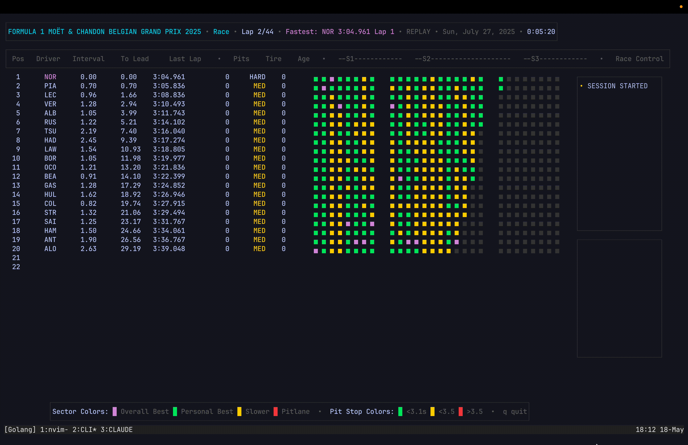

# Pitwall TUI

> A terminal-based F1 live timing dashboard, powered by the OpenF1 API.

* * *

## What it is

Pitwall acts as a supplment while watching F1 races, by displaying historical race interval data, tire wear, pitstop times, sector heatmaps, and race control messages, in real-time.
Like the timing tower, but better.

Built in Go with [BubbleTea](https://github.com/charmbracelet/bubbletea), using the public [OpenF1 API](https://openf1.org/).

> **Status:** Work in progress. Core data and layout are functional; some features are still being built out. Expect rough edges.
* * *

## Quick start
    
    git clone https://github.com/nstandage/Pitwall-TUI.git
    cd Pitwall-TUI
    go run .
    

Pitwall uses the public OpenF1 API, so no API key required.
* * *

## Features

- **Interval wall** -- live interval and gap-to-leader for all drivers
- **Sector heatmaps** -- color-coded sectors per driver
- **Race control log** -- flags, penalties, safety car calls, and steward messages
- **Replay engine** -- replay historical sessions with accurate timestamp pacing
- **Pit Stop Times** -- tire wear, pit stop times, and # of pit stops per driver
* * *

## Roadmap

- [ ] Live session support (requires OpenF1 API key)

* * *

## License

MIT
